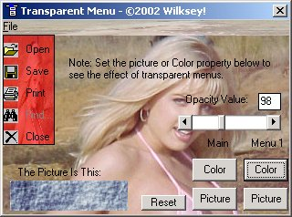



## Alpha Blending Menus V2

### Description

Shows you how to alpha blend menus
 
### More Info
 
picture

none i know of

             |
---                |---
**Submitted On**   |2002-07-08 00:16:04
**By**             |[Wilksey\!](https://github.com/Planet-Source-Code/PSCIndex/blob/master/ByAuthor/wilksey.md)
**Level**          |Intermediate
**User Rating**    |5.0 (10 globes from 2 users)
**Compatibility**  |VB 6\.0
**Category**       |[Graphics](https://github.com/Planet-Source-Code/PSCIndex/blob/master/ByCategory/graphics__1-46.md)
**World**          |[Visual Basic](https://github.com/Planet-Source-Code/PSCIndex/blob/master/ByWorld/visual-basic.md)
**Archive File**   |[Alpha\_Blen103221772002\.zip](https://github.com/Planet-Source-Code/wilksey-alpha-blending-menus-v2__1-36691/archive/master.zip)

### API Declarations

This is a pretty basic example, its not the greatest, but it should get u started!

